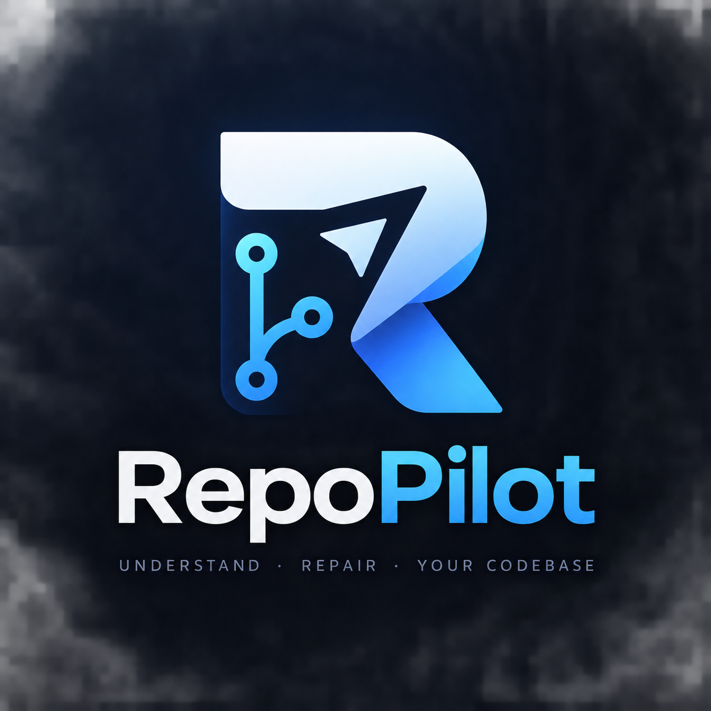
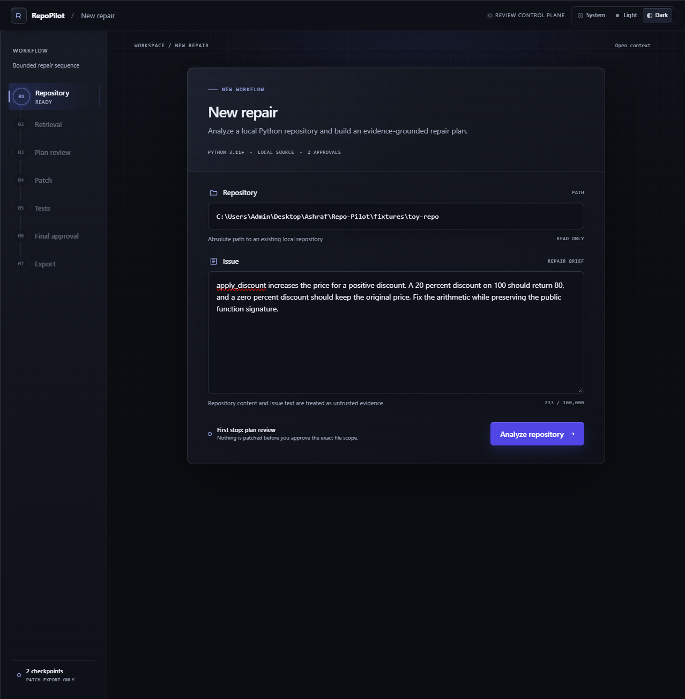
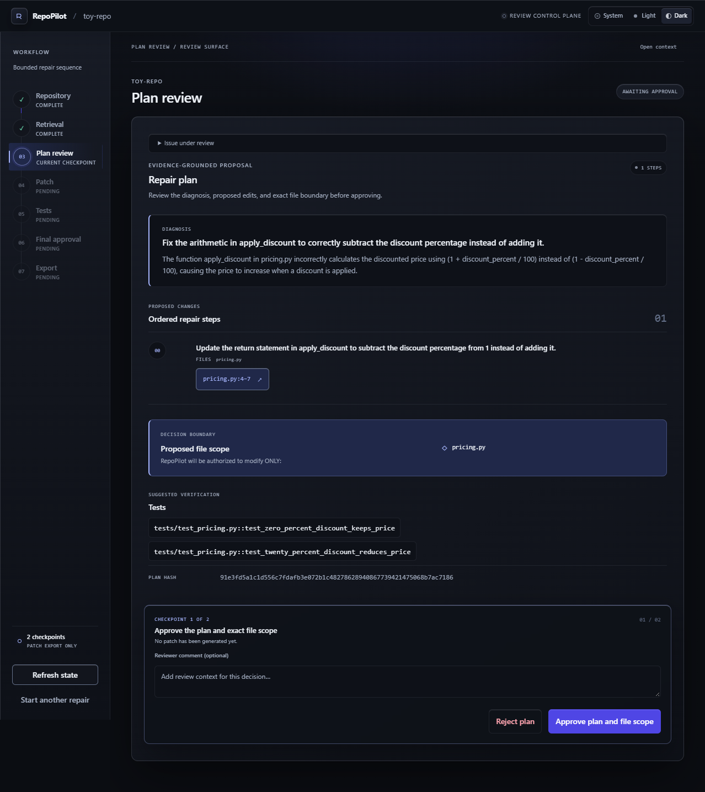
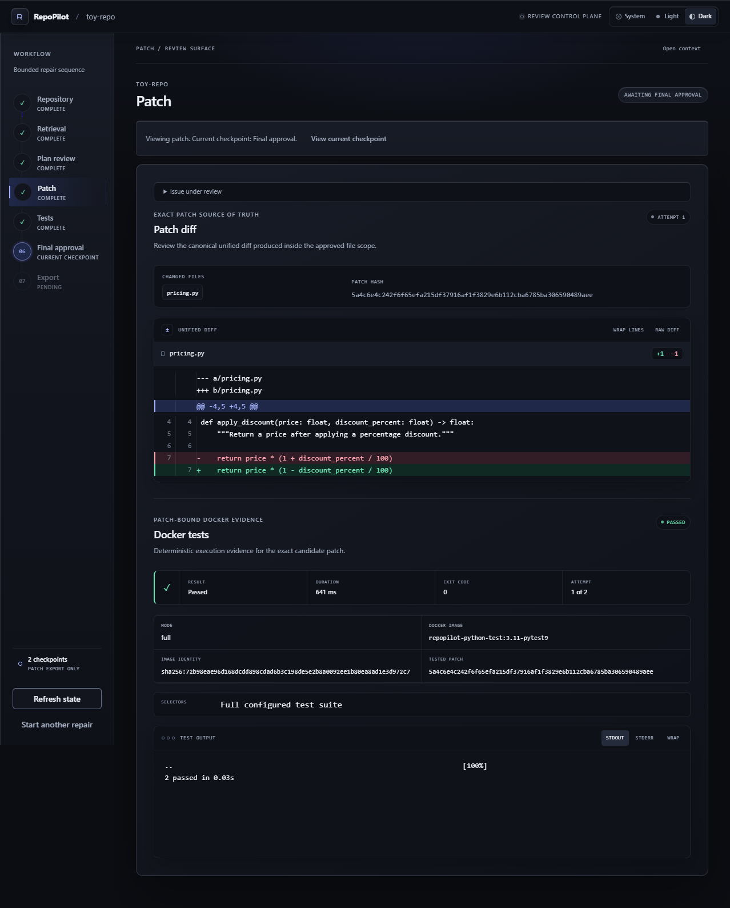
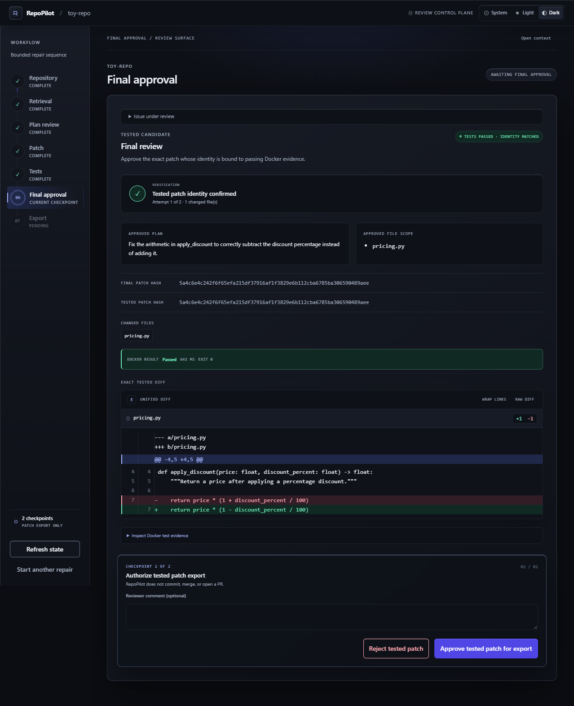
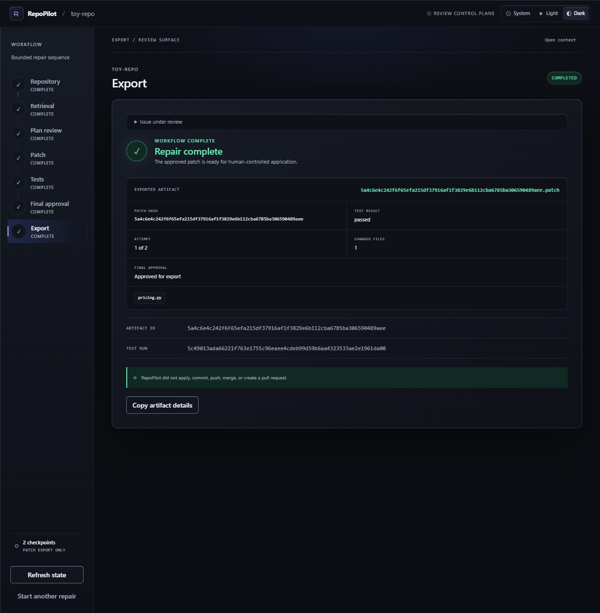

<p align="center">
  
</p>

<p align="center">
  <strong>Evidence-grounded, human-controlled code repair for Python repositories.</strong>
</p>

<p align="center">
  RepoPilot retrieves structural repository evidence, proposes a bounded repair plan,
  generates only approved-scope patches, runs tests in an isolated Docker sandbox,
  and requires explicit human approval before export.
</p>

---

## Overview

RepoPilot is a local-first coding repair agent built around a simple rule:

> **Understand the repository, show the evidence, and keep the human in control.**

Given a Python repository and an issue, RepoPilot:

1. discovers and parses the repository with tree-sitter;
2. builds provenance-preserving code chunks;
3. retrieves relevant code using BM25 + dense embeddings + Reciprocal Rank Fusion;
4. expands one hop through structural relationships;
5. packs the evidence into a bounded `ContextPack`;
6. generates an evidence-grounded repair plan;
7. pauses for **Human Checkpoint 1**;
8. generates an exact, approved-scope patch in an isolated workspace;
9. runs pytest inside a restricted Docker sandbox;
10. optionally allows one critic-assisted retry after a genuine test failure;
11. pauses for **Human Checkpoint 2**;
12. exports the exact tested patch — never an autonomous commit, merge, or PR.

---

## Repopilot Review Workbench

<p align="center">
  
</p>

RepoPilot's React review workspace exposes the complete repair lifecycle from one interface: retrieved evidence, repair planning, exact file scope, unified diffs, Docker test evidence, both human approvals, and the final patch export.

| Plan review | Patch + tests |
| --- | --- |
|  |  |

| Final approval | Export complete |
| --- | --- |
|  |  |

The workbench supports **Dark**, **Light**, and **System** themes. Navigation through completed stages is read-only; workflow authority remains in the backend.

---

## Measured Results

### Controlled provider comparison

The same frozen six controlled defects across three public Python repositories were run with the same retrieval pipeline, prompts, validators, approval policy, Docker policy, and retry limit. Only the generation provider changed.

| Metric | Local Gemma (CPU-only) | Gemini 3.1 Flash-Lite |
| --- | ---: | ---: |
| Successful repairs | **1 / 6** | **6 / 6** |
| Attempt-1 successes | 1 / 6 | 6 / 6 |
| Grounded plans | 3 / 6 | 6 / 6 |
| Exact citation validity | 3 / 6 | 6 / 6 |
| Valid patches | 1 | 6 |
| Docker passes | 1 | 6 |
| Planner parse failures | 0 | 0 |
| Grounding failures | 3 | 0 |
| Provider/API failures | 0 | 0 |
| Median planner latency | 85.169 s | 2.288 s |
| Median total workflow latency | 110.912 s | 20.928 s |

This is **not** a general model ranking. Gemma ran locally on CPU; Gemini used a hosted API and network access. The comparison is intentionally limited to six controlled defects.

Detailed artifacts:

- [`evaluation/results/m9-gemini-3.1-flash-lite-v1/m9-report.md`](evaluation/results/m9-gemini-3.1-flash-lite-v1/m9-report.md)
- [`evaluation/results/provider-comparison/gemini-3.1-flash-lite-v1/provider-comparison.md`](evaluation/results/provider-comparison/gemini-3.1-flash-lite-v1/provider-comparison.md)

### Retrieval

On the frozen M8-v2 local retrieval suite:

| Metric | Result |
| --- | ---: |
| Hybrid file Hit@1 | **1.00** |
| Hybrid file Hit@5 | **1.00** |
| Hybrid MRR | **1.00** |
| Gold file coverage | **1.00** |
| Gold symbol coverage | **1.00** |
| Mean file chunk precision | **0.4145** |
| Mean file token waste | **0.5837** |

Reducing returned retrieval depth from 10 to 5 preserved full hybrid Hit@1/Hit@5/MRR while improving context precision and reducing token waste.

Detailed report:

- [`evaluation/results/m8-v2/m8-report.md`](evaluation/results/m8-v2/m8-report.md)

### Safety

RepoPilot passed **33 / 33 deterministic safety scenarios** in the frozen M8-v2 safety suite.

The suite covers bounded authority and failure handling around areas such as:

- out-of-scope edits;
- invented evidence;
- stale approvals;
- patch identity mismatches;
- retry limits;
- canonical repository mutation;
- export ordering;
- provider and workflow failures.

A validator rejection is treated as a safe model failure, not silently accepted output.

---

## Architecture

```text
Repository + Issue
        |
        v
Repository Discovery
        |
        v
tree-sitter AST Chunks + Provenance
        |
        +-------------------+
        |                   |
        v                   v
   SQLite BM25        Dense Embeddings
        |                   |
        +-------- RRF ------+
                 |
                 v
      One-Hop Structural Expansion
                 |
                 v
        Bounded ContextPack
                 |
                 v
     Evidence-Grounded RepairPlan
                 |
                 v
       HUMAN CHECKPOINT 1
                 |
                 v
      Approved-Scope Patch
                 |
                 v
      Isolated Review Workspace
                 |
                 v
      Canonical Diff + Patch Hash
                 |
                 v
   Restricted Docker Pytest Runner
          |               |
          | pass          | genuine fail
          v               v
  HUMAN CHECKPOINT 2    Critic
          |               |
          |               v
          |          One Retry Maximum
          |               |
          +---------------+
                 |
                 v
           Patch Export
```

### Retrieval

RepoPilot combines:

- **SQLite FTS5 / BM25** for identifiers and lexical matches;
- **EmbeddingGemma + Chroma** for dense semantic retrieval;
- **Reciprocal Rank Fusion** for deterministic rank-only fusion;
- **one-hop structural expansion** across local imports, parent/child relationships, and related tests;
- **whole-chunk bounded context packing** with source provenance and hard budget limits.

If dense retrieval is unavailable, RepoPilot can degrade explicitly to lexical evidence rather than hiding the failure.

### Planning and patching

Generation output is never treated as authority by itself.

RepoPilot applies deterministic validation after model output:

- exact evidence citation validation;
- approved-file scope enforcement;
- hash-bound approval identity;
- exact-match patch replacement;
- stale-source rejection;
- maximum two patch attempts;
- final approval bound to the exact tested patch.

### Sandbox

Tests execute against a disposable snapshot using a restricted Docker runner with bounded resources and no autonomous image pull during repair.

The canonical source repository is not directly edited during repair.

---

## Human Authority

RepoPilot has two explicit checkpoints.

### Checkpoint 1 — approve the repair plan

Before patch generation, the reviewer sees:

- diagnosis;
- proposed repair steps;
- exact file scope;
- supporting evidence;
- suggested tests.

The approved plan and scope are hash-bound.

### Checkpoint 2 — approve the tested patch

Before export, the reviewer sees:

- the exact final diff;
- changed files;
- Docker test evidence;
- patch/test identity;
- attempt history.

RepoPilot does **not** commit, push, merge, open a PR, or apply the exported patch automatically.

---

## Inference Providers

RepoPilot uses a generation-provider boundary.

### Ollama / local Gemma

The default local path keeps generation on the user's machine and requires no hosted generation API.

### Gemini

An optional Gemini provider uses the same planner, patcher, critic, deterministic validators, approvals, and evaluation pipeline.

When Gemini is selected, bounded generation context is sent to Google's hosted Gemini API. Retrieval remains independently configured and can stay local through EmbeddingGemma.

The provider can change; the authority model does not.

---

## Tech Stack

| Area | Technology |
| --- | --- |
| Backend | Python 3.11+, FastAPI |
| Parsing | tree-sitter |
| Lexical retrieval | SQLite FTS5 / BM25 |
| Dense retrieval | EmbeddingGemma, Chroma |
| Fusion | Reciprocal Rank Fusion |
| Context | One-hop structural expansion + bounded `ContextPack` |
| Orchestration | LangGraph + selective LangChain |
| Generation | Ollama / Gemma, optional Gemini |
| Validation | Pydantic + first-party deterministic checks |
| Sandbox | Restricted Docker + pytest |
| Persistence | SQLite workflow checkpoints |
| Frontend | React, Vite, TypeScript |
| Dependency management | uv |

---

## Local Setup

### Prerequisites

- Python 3.11+
- [`uv`](https://docs.astral.sh/uv/)
- Node.js + npm
- Ollama
- Docker Desktop

Detailed environment, Docker image, provider, benchmark, and troubleshooting instructions are in [`docs/setup.md`](docs/setup.md).

### 1. Configure environment

Copy the example environment file:

```powershell
Copy-Item .env.example .env
```

For local Ollama generation, the default provider remains local.

For optional Gemini generation:

```env
REPOPILOT_GENERATION_PROVIDER=gemini
REPOPILOT_GEMINI_API_KEY=your_key_here
REPOPILOT_GEMINI_MODEL=gemini-3.1-flash-lite
```

Never commit `.env`.

### 2. Backend

```powershell
cd backend
uv sync --locked
uv run uvicorn app.main:app --reload --host 127.0.0.1 --port 8000
```

### 3. Frontend

In another terminal:

```powershell
cd frontend
npm ci
npm run dev
```

Open:

```text
http://localhost:5173
```

### 4. Docker + embeddings

Start Docker Desktop and ensure the configured RepoPilot Python test image exists.

Start Ollama with the embedding model required by your retrieval configuration.

See [`docs/setup.md`](docs/setup.md) for the exact tested commands and environment variables.

---

## Evaluation Artifacts

RepoPilot keeps benchmark evidence versioned in the repository.

Key entry points:

- [`evaluation/results/m8-v2/m8-report.md`](evaluation/results/m8-v2/m8-report.md) — optimized retrieval + safety
- [`evaluation/results/m9-v3/m9-report.md`](evaluation/results/m9-v3/m9-report.md) — frozen local Gemma system evaluation
- [`evaluation/results/m9-gemini-3.1-flash-lite-v1/m9-report.md`](evaluation/results/m9-gemini-3.1-flash-lite-v1/m9-report.md) — Gemini system evaluation
- [`evaluation/results/provider-comparison/gemini-3.1-flash-lite-v1/provider-comparison.md`](evaluation/results/provider-comparison/gemini-3.1-flash-lite-v1/provider-comparison.md) — controlled provider comparison
- [`evaluation/results/m10/final-report.md`](evaluation/results/m10/final-report.md) — measured optimization and final validation
- [`docs/benchmarks.md`](docs/benchmarks.md) — benchmark methodology
- [`docs/failures.md`](docs/failures.md) — failure analysis

---

## Testing

The repository includes automated coverage for:

- repository discovery and path boundaries;
- Python parsing and code chunks;
- lexical, dense, and hybrid retrieval;
- structural expansion and context packing;
- planner parsing and grounding;
- durable pause/resume checkpoints;
- approved-scope patch generation;
- stale-source and stale-approval rejection;
- canonical diff/hash identity;
- Docker command and sandbox restrictions;
- critic grounding and two-attempt enforcement;
- final approval and exact patch export;
- workflow API behavior;
- Graphite review UI behavior.

The final project verification included **350 backend tests** and the frontend test/build/typecheck gates used by the project.

---

## Design Constraints

RepoPilot intentionally does **not** include:

- autonomous Git commits;
- push/merge actions;
- pull-request creation;
- unrestricted shell access;
- unbounded repair loops;
- multi-agent swarms;
- a full IDE;
- multi-language support in V1.

The V1 goal is depth, bounded behavior, inspectability, and measured evidence — not feature count.

---

## Limitations

- Python repositories only.
- The retrieval suites are controlled and small.
- The six-case external/system comparison is not SWE-bench and is not a production accuracy estimate.
- Local CPU generation is significantly slower than hosted Gemini in the measured setup.
- Dense retrieval can degrade when the local embedding provider is unavailable or unstable.
- Gemini mode sends bounded generation context off-machine.
- RepoPilot exports a patch; it does not autonomously apply or merge it.

---

## Project Thesis

RepoPilot is built around one inspectable loop:

> **what it retrieved → why it planned a change → what it changed → what tests ran → what failed → what the human approved**

That is the product.
